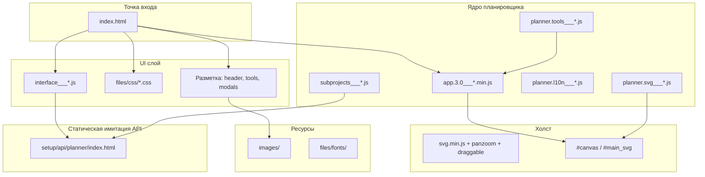
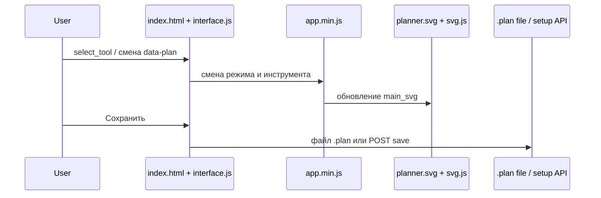

# Структура проекта RemPlanner

Документ описывает состав репозитория [rplanner.github.io](https://github.com/rplanner/rplanner.github.io) — статического сайта с веб-планировщиком квартиры для ремонта.

## Содержание

- [Обзор](#обзор)
- [Дерево каталогов](#дерево-каталогов)
- [Архитектура приложения](#архитектура-приложения)
- [Точка входа: index.html](#точка-входа-indexhtml)
- [Режимы плана (data-plan)](#режимы-плана-data-plan)
- [JavaScript](#javascript)
- [CSS и шрифты](#css-и-шрифты)
- [Изображения](#изображения)
- [API и сохранение](#api-и-сохранение)
- [Вспомогательные модули](#вспомогательные-модули)
- [Особенности для разработчиков](#особенности-для-разработчиков)

---

## Обзор

**RemPlanner** — одностраничное приложение (SPA-подобное), развёрнутое на **GitHub Pages**. Пользователь проходит этапы ремонта: от исходного плана и демонтажа до электрики, отделки и инженерных систем.

| Характеристика | Значение |
|----------------|----------|
| Точка входа | [index.html](../index.html) (~4650 строк) |
| Сборка в репозитории | Отсутствует (нет `package.json`, webpack/vite) |
| Ядро логики | Готовые бандлы в [files/js/v2/app/](../files/js/v2/app/) |
| Рендер плана | SVG ([svg.js](https://github.com/svgdotjs/svg.js) + собственный [planner.svg](../files/js/v2/app/planner.svg___6___1717160538.js)) |
| Хостинг | GitHub Pages (`origin`: `https://github.com/rplanner/rplanner.github.io.git`) |

В репозитории хранится **готовый к публикации статический сайт**, а не исходники с TypeScript/React.

---

## Дерево каталогов

```
rplanner.github.io/
├── index.html              # Единственная HTML-страница приложения
├── docs/
│   └── STRUCTURE.md        # Этот документ
├── files/                  # Стили, скрипты, шрифты
│   ├── css/
│   │   ├── planner.css
│   │   ├── planner_ui.css
│   │   ├── mobile.css
│   │   └── v2/planner_my.css
│   ├── fonts/              # Open Sans (woff2)
│   ├── img/v2/
│   ├── js/
│   │   ├── jquery.slimscroll.js
│   │   ├── saveSvgAsPng.js
│   │   └── v2/
│   │       ├── app/        # Бандлы планировщика
│   │       └── js/         # Библиотеки (svg, pdf, load_image…)
│   └── min/                # Скомпонованные CSS/JS (jQuery, reset.css…)
├── images/                 # ~1559 файлов: UI, иконки, превью инструментов
│   ├── design/             # UI v2, гайды, icons/
│   ├── tools/              # Превью по toolid (*.jpg)
│   ├── planner/
│   ├── logo/
│   └── …
├── setup/
│   └── api/planner/
│       └── index.html      # Заглушка JSON API
├── PLANS/                  # Пример файла проекта *.plan
├── print/
│   └── print.min.js
└── preventclose/
    └── preventclose.js
```

### Назначение корневых каталогов

| Путь | Назначение |
|------|------------|
| [index.html](../index.html) | Разметка UI, подключение всех ресурсов |
| [files/](../files/) | CSS, JS, шрифты, частичные бандлы |
| [images/](../images/) | Статические изображения интерфейса и каталога инструментов |
| [setup/](../setup/) | Статическая имитация backend API |
| [PLANS/](../PLANS/) | Примеры сохранённых проектов (`.plan`) |
| [print/](../print/) | Библиотека печати (printJS) |
| [preventclose/](../preventclose/) | Предупреждение при закрытии вкладки |

---

## Архитектура приложения



### Поток взаимодействия



---

## Точка входа: index.html

Файл [index.html](../index.html) объединяет три роли:

1. **Оболочка сайта** — header, навигация, модальные окна, чат, PRO-элементы.
2. **Каталог инструментов** — сотни `div.tools_item` с `onclick="select_tool(...)"` и классами видимости `show_on_*`.
3. **Контейнер холста** — `#planner_container` → `#canvas_v2_wrapper` → `#canvas`.

### Ключевые DOM-узлы

| ID / класс | Назначение |
|------------|------------|
| `#groups_navi` | Вкладки этапов ремонта (`data-plan`) |
| `#planner_ui_tools` | Левая панель инструментов |
| `#planner_container` | Область планировщика |
| `#canvas` | SVG-холст |
| `#main_svg` | Корневой SVG-документ плана (создаётся скриптами) |
| `body[data-object-id]` | ID объекта на сервере (0 в гостевом режиме) |

### Флаги окружения (inline в `<head>`)

```javascript
window.l10n = new Object();
const isAdmin = false;
const isProd = true;
const langUrl = '';
```

### Порядок загрузки скриптов планировщика

После jQuery и оболочки (`files/min/`) подключаются в таком порядке:

1. `load_image*.js`, `jquery.jcrop.js` — фоновое изображение плана
2. `jszip.min.js`, `jspdf.fork*.js` — экспорт
3. `svg.min.js`, `svg.panzoom.js`, `svg.draggable.js` — холст
4. `planner.tools___*.js` — каталог инструментов
5. `planner.l10n___*.js` — локализация
6. `planner.svg___*.js` — отрисовка SVG-элементов
7. `app.3.0___*.min.js` — **ядро** (геометрия, состояние, режимы)
8. `saveSvgAsPng.js` — экспорт в PNG
9. `interface___*.js` — UI-логика (модалки, сохранение, навигация)
10. `subprojects___*.js` — версии планировок и этажи

> В `<head>` часть ссылок дублируется: абсолютные (`/files/...`) и относительные (`files/...`). Оба варианта рассчитаны на разные сценарии раздачи статики.

---

## Режимы плана (data-plan)

Верхняя навигация `#groups_navi` переключает **режим** — набор доступных инструментов и слоёв плана. Атрибут `data-plan` на элементах `.groups_navi_item`:

| `data-plan` | Название в UI |
|-------------|----------------|
| `init` | Исходный план |
| `break_walls` | Демонтаж |
| `create_walls` | Перегородки |
| `projections` | Развертки стен |
| `rooms` | Помещения |
| `radiators` | Радиаторы |
| `furniture` | Мебель |
| `santeh` | Сантехника |
| `waterplan` | Водоснабжение |
| `sockets` | Розетки |
| `light` | Освещение |
| `light_connections` | Выключатели |
| `warm_floor` | Теплые полы |
| `conditioners` | Кондиционеры |
| `ventilation` | Вентиляция |
| `security` | Безопасность |
| `cables` | Электропроводка |
| `floor` | Напольные покрытия |
| `walls` | Отделка стен |
| `ceiling` | Потолки |
| `hydroisolation` | Гидроизоляция |
| `isolation` | Изоляция |
| `shtukaturka` | Штукатурка |
| `styazhka` | Стяжка |

Инструменты в `#planner_ui_tools` показываются через CSS-классы вида `show_on_init`, `show_on_sockets`, `show_on_break_walls` и т.д.

---


### Панель «Equipment»

- Панель отображается в режимах `sockets` и `light_connections`: список настенных розеток, выключателей и рамок (по числу постов).
- Для рамок каждый механизм считается как один физический пост, включая многоклавишные выключатели.
- Розетки, выключатели и рамки группируются по модели изделия и фактическому цвету: `fixture_class` + `fixture_color`. Розетки дополнительно группируются по наличию шторок: `fixture_shutters`.
- Для `socket_group` модель, цвет и шторки хранятся на контейнере группы, а не на отдельных механизмах. Поэтому смена параметра у одной розетки или выключателя меняет всю рамочную группу; шторки влияют только на строки розеток в комплектации.
- Панель содержит настройки `fixture_settings.default_colors` и `fixture_settings.class_names`: они определяют цвета по умолчанию и пользовательские названия моделей.
- Логика: [files/js/equipment.js](../files/js/equipment.js).

### Модель, цвет и шторки электроустановочных изделий

Настенные розетки и выключатели поддерживают дополнительные свойства в `props`:

- `fixture_class` — модель изделия. Значения: `main` («Основная»), `technical` («Техническая»), `premium` («Премиальная»); отображаемые названия могут переопределяться через `fixture_settings.class_names`.
- `fixture_color` — цвет. Значения: `default` («По умолчанию»), `white_glossy`, `white_matte`, `cashmere`, `silk`, `steel`, `titanium`, `graphite`, `black_matte`, `denim`, `cotton`, `cappuccino`, `gray`.
- `fixture_shutters` — наличие шторок у розеток. Значения: `with_shutters` («Со шторками»), `without_shutters` («Без шторок»).
- `fixture_settings.default_colors` — проектные настройки фактического цвета для `default` по моделям. Сохраняются в экспортируемый `.plan` через `project.copy()` и читаются в `project.restore()`.
- `fixture_settings.class_names` — пользовательские названия моделей для отображения в списках и комплектации.

По умолчанию новые элементы получают `main` и `default`, а розетки дополнительно получают `with_shutters`. В комплектации вместо «По умолчанию» выводится фактический цвет из `fixture_settings.default_colors` для выбранной модели. Селекты модели и цвета доступны в контекстных меню розеток и выключателей для обычных настенных механизмов; селект шторок доступен только у розеток. Для силовых, 380В, напольных, потолочных розеток и выводов проводов эти параметры не показываются.

Общий справочник классов, цветов, allowlist и обработчики контекстного меню находятся в [files/js/fixture_options.js](../files/js/fixture_options.js).

## JavaScript

### Бандлы приложения ([files/js/v2/app/](../files/js/v2/app/))

Имена файлов содержат номер версии и Unix-timestamp сборки (`___82___1723808709`).

| Файл | Размер | Роль |
|------|--------|------|
| [app.3.0___82___1723808709.min.js](../files/js/v2/app/app.3.0___82___1723808709.min.js) | ~7.6 MB | Ядро: `window.project`, `window.plan`, `window.tool`, геометрия стен/комнат, сохранение |
| [planner.tools___13___1722349909.js](../files/js/v2/app/planner.tools___13___1722349909.js) | ~2.9 MB | Описания и метаданные инструментов |
| [planner.svg___6___1717160538.js](../files/js/v2/app/planner.svg___6___1717160538.js) | ~1.6 MB | SVG-представления элементов плана |
| [interface___5___1720782485.js](../files/js/v2/app/interface___5___1720782485.js) | ~60 KB | UI: модалки, навигация, AJAX, трекер шагов, bugreport |
| [planner.l10n___5___1719915083.js](../files/js/v2/app/planner.l10n___5___1719915083.js) | ~40 KB | Строки `window.l10n` (ошибки соединений, подсказки) |
| [subprojects___1___1717151865.js](../files/js/v2/app/subprojects___1___1717151865.js) | ~10 KB | Версии планировок и этажи (CRUD через API) |

### Глобальное состояние (ядро)

В `app.*.min.js` инициализируются ключевые переменные:

- `window.project`, `window.plan`, `window.plans`, `window.tool`, `window.tools`
- `window.mode`, `window.drawing`, `window.selected`
- `window.planner_version = 3`, `window.global_version = 206`

### Библиотеки ([files/js/v2/js/](../files/js/v2/js/))

| Компонент | Файлы | Назначение |
|-----------|-------|------------|
| SVG-холст | `svg.min.js`, `svg.panzoom.js`, `svg.draggable.js` | Масштаб, перетаскивание |
| PDF | `jspdf.fork.min.js`, `jspdf.fork.svg2pdf.min.js` | Экспорт плана в PDF |
| Архивы | `jszip.min.js` | Упаковка данных |
| PNG | [saveSvgAsPng.js](../files/js/saveSvgAsPng.js) | Снимок SVG |
| Фон плана | `load/load_image*.js`, `jquery.jcrop.js` | Загрузка, EXIF/IPTC, обрезка |
| jQuery | [files/min/jquery-3.1.1.min.js](../files/min/jquery-3.1.1.min.js) | DOM, AJAX |

### Скомпонованные бандлы ([files/min/](../files/min/))

| Файл | Содержимое |
|------|------------|
| `jquery-3.1.1.min.js` | jQuery 3.1.1 |
| `reset.css` | Объединённые базовые стили (~500 KB) |
| `index.html` | Большой бандл: jQuery + fancybox + front/design/structure + chat |

Ссылки вида `/files/min/?f=reset.css,classes.css,...&b=files/css` в [index.html](../index.html) ожидают **серверную склейку** файлов; в репозитории отдельных `classes.css`, `layout.css` в `files/css/` нет — они входят в `files/min/reset.css` или бандл `index.html`.

---

## CSS и шрифты

### Файлы в репозитории ([files/css/](../files/css/))

| Файл | Назначение |
|------|------------|
| [planner.css](../files/css/planner.css) | Стили холста и элементов плана |
| [planner_ui.css](../files/css/planner_ui.css) | Панели, инструменты, навигация |
| [mobile.css](../files/css/mobile.css) | Адаптив для мобильных |
| [v2/planner_my.css](../files/css/v2/planner_my.css) | Дополнительные стили v2 |

### Шрифты ([files/fonts/](../files/fonts/))

Open Sans (cyrillic + latin), начертания 300, regular, 700 — формат `woff2`.

---

## Изображения

Каталог [images/](../images/) (~1559 файлов):

| Подкаталог | ~Файлов | Содержимое |
|------------|---------|------------|
| `design/` | 847 | UI v2, гайды (`design/v2/ui/guide/`), логотипы, [design/icons/](../images/design/icons/) — иконки элементов (розетки, радиаторы, вентиляция…) |
| `tools/` | 678 | Превью инструментов: `images/tools/{toolid}.jpg` |
| `planner/` | 11 | Скриншоты поддержки, layout |
| `structure/` | 16 | Фоны и иконки оболочки |
| `logo/` | 3 | Логотип, favicon-подобные |
| `studio/`, `domains/`, `favicon/` | немного | Брендинг, домены |

Favicon в HTML: [images/logo/RP.png](../images/logo/RP.png).

---

## API и сохранение

### Ожидаемые endpoint'ы (клиент)

Клиент обращается к backend по префиксу `/setup/api/`:

| Путь | Использование |
|------|----------------|
| `/setup/api/planner/new/` | Новый проект |
| `/setup/api/planner/save_settings/` | Настройки |
| `/setup/api/planner/plan_add_new/` | Новая версия планировки |
| `/setup/api/planner/plan_delete/` | Удаление версии |
| `/setup/api/planner/plan_edit_name/` | Переименование |
| `/setup/api/planner/floor_add_new/` | Новый этаж |
| `/setup/api/planner/floor_delete/` | Удаление этажа |
| `/setup/api/bugreport/` | Отчёт об ошибке |
| `/setup/api/signal/` | Аналитические сигналы |

### Заглушка в репозитории

[setup/api/planner/index.html](../setup/api/planner/index.html) — статический JSON с пустым проектом. Поле `data` — строка JSON с ключами:

`walls`, `pillars`, `sectors`, `rooms1`, `rooms2`, `windows`, `doors`, `items`, `led_strips`, `wires`, `comments`, `rulers`, `questions`.

На GitHub Pages полноценный backend **отсутствует**; для работы без сервера используется **локальный файл `.plan`**.

### Локальное сохранение

- **Сохранить**: `#save_as_file` — выгрузка `.plan`
- **Загрузить**: `#load_from_file` — `input[accept=".plan"]`
- Пример: [PLANS/Remplanner #file 2024-05-10 12.52.plan](../PLANS/)

---

## Вспомогательные модули

### [print/print.min.js](../print/print.min.js)

Печать SVG/HTML через printJS (вызов из [index.html](../index.html) с `printable: 'main_svg'`).

### [preventclose/preventclose.js](../preventclose/preventclose.js)

```javascript
window.onbeforeunload = function() { return "Would you really like to close your browser?"; }
```

Предупреждение при закрытии вкладки с несохранёнными изменениями (если скрипт подключён).

---

## Особенности для разработчиков

1. **Нет исходников сборки** — правки логики плана напрямую в `app.*.min.js` практически невозможны без оригинального репозитория разработки.
2. **Монолитный HTML** — большая часть UI захардкожена в [index.html](../index.html); добавление инструмента = правка HTML + данные в `planner.tools`.
3. **Версионирование бандлов** — при обновлении JS нужно менять имена файлов и ссылки в `index.html` (query `?1724128515` для cache-bust).
4. **Гостевой режим** — `data-object-id="0"`, `data-authkey="0"` на `<body>`; функции `set_planner_guest_mode()` в interface.js.
5. **Два пути к статике** — `/files/...` и `files/...`; при локальном открытии `file://` часть запросов может не работать — нужен HTTP-сервер.
6. **README отсутствует** — этот документ (`docs/STRUCTURE.md`) служит ориентиром по структуре репозитория.

---

*Документ сгенерирован по состоянию репозитория. При изменении имён бандлов или структуры каталогов обновите соответствующие разделы.*
